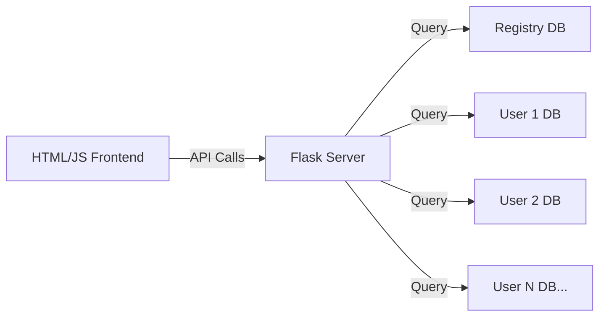

# DuckDB User Analytics POC

A simple proof of concept for user analytics using DuckDB, Flask, and Chart.js. The application demonstrates a scalable architecture where each user's data is stored in a separate DuckDB instance.



## Features

- Separate DuckDB instance for each user's data
- Central registry database to track user databases
- Simple Flask API server
- Basic frontend visualization using Chart.js
- Sample data generation for testing

## Directory Structure

```sh
.
├── app.py              # Flask backend server
├── index.html          # Frontend application
├── data/
│   ├── registry.db     # Central registry database
│   └── user_dbs/       # Individual user databases
│       ├── user_1.db
│       ├── user_2.db
│       └── ...
└── README.md
```

## Prerequisites

- Python 3.10+
- pip

## Installation

1. Clone the repository:

    ```sh
    git clone git@github.com:patricktrainer/duckdb-user-analytics.git
    cd duckdb-user-analytics
    ```

2. Install dependencies:

    ```sh
    pip install duckdb flask flask-cors
    ```

## Usage

1. Start the server:

    ```bash
    python app.py
    ```

2. Open your browser and navigate to:

    ```sh
    http://127.0.0.1:5000
    ```

## API Endpoints

- `GET /users` - Returns list of available users
- `GET /metrics/<user_id>` - Returns daily metrics for specified user

## Architecture

### Backend

- Flask server handles API requests
- Registry database tracks all user databases
- Each user has their own DuckDB instance
- Sample data generation for testing

### Frontend

- Simple HTML/JavaScript interface
- Chart.js for data visualization
- Responsive time series chart
- User selection dropdown

## Sample Data

The application generates sample data for testing:

- 5 users by default
- Daily counts from 2024-01-01 to 2024-02-01
- Random values between 0-100

## Development

To modify sample data generation, update the `generate_sample_data()` method in `app.py`:

```python
def generate_sample_data(self):
    for user_id in range(1, 6):  # Modify number of users
        ...
```

## Performance Considerations

- Each user's data is isolated in its own database file
- Scales horizontally with number of users
- Efficient querying for individual user metrics
- Registry database provides quick user lookup

## Future Improvements

- Add authentication
- Implement data ingestion API
- Add more complex analytics
- Enhance visualization options
- Add data export functionality
- Implement user management

## License

MIT

## Contributing

1. Fork the repository
2. Create your feature branch
3. Commit your changes
4. Push to the branch
5. Create a new Pull Request
